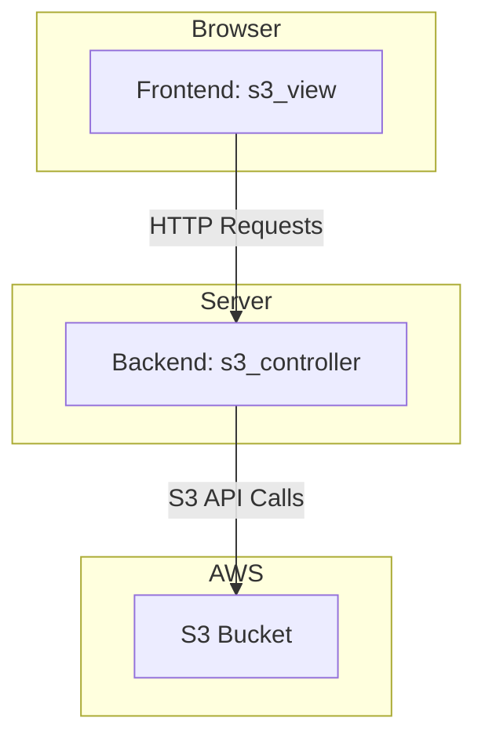

# S3 Viewer

S3 Viewer is a utility for browsing the contents of S3 buckets. It consists of a web server written in Rust using the Axum framework and a frontend application built with Yew and compiled to WebAssembly.

## Architecture

The application is divided into three main components:

- `s3_controller`: The backend server that handles requests to the S3 API and serves the static frontend files.
- `s3_view`: The frontend Yew/WASM application that runs in the browser.
- `s3_model`: A shared data model library used by both the backend and the frontend.

Below is a component diagram illustrating the interaction between them.



## Building and Running

### Backend (s3_controller)

To run the server, follow these steps:

1.  Navigate to the `s3_controller` directory:
    ```bash
    cd s3_controller
    ```
2.  Run the server using the `run` script:
    ```bash
    ./run
    ```
    *Note: The `run` script is a wrapper for `cargo run`. You may need to configure your AWS environment variables for access.*

### Frontend (s3_view)

To build and run the frontend:

1.  Install [Trunk](https://trunkrs.dev/) if you haven't already:
    ```bash
    cargo install --locked trunk
    ```
2.  Navigate to the `s3_view` directory:
    ```bash
    cd s3_view
    ```
3.  Build the application using the `build.sh` script:
    ```bash
    ./build.sh
    ```
4.  To run in development mode, use the `run.sh` script:
    ```bash
    ./run.sh
    ```
    This will start a local development server that automatically rebuilds the application on changes.
